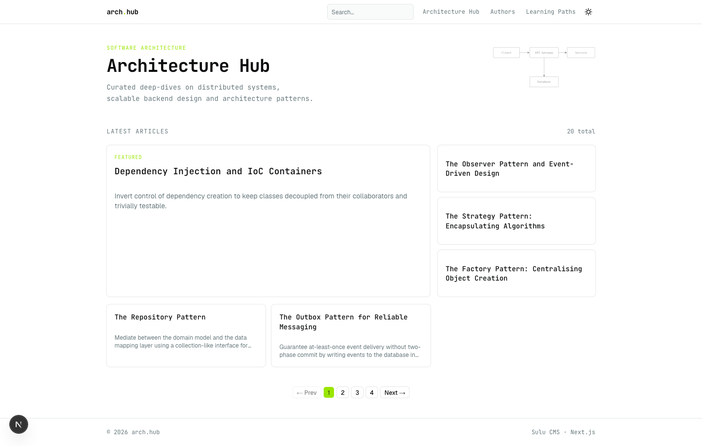
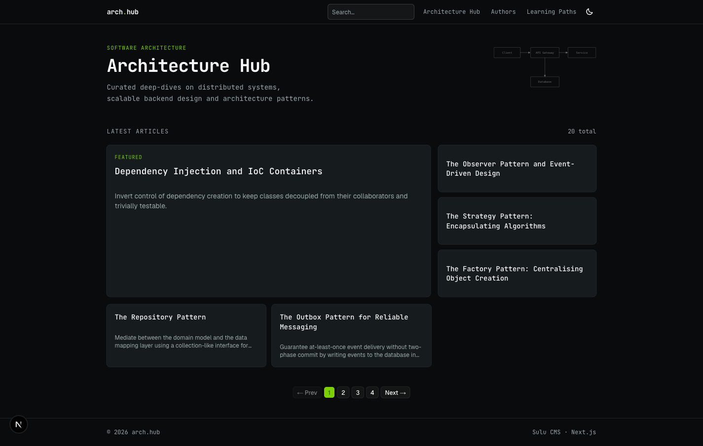

# Architecture Hub Showcase

A headless knowledge platform for software architecture and system design — built to demonstrate end-to-end ownership across a modern full-stack, spec-driven workflow.

> **Live demo**: _coming soon_

<p align="center">
  
  
</p>

---

## What this project demonstrates

This is a portfolio project, not a commercial product. The goal is to show how a structured engineering approach — written specifications, documented architecture decisions, and automated pipelines — produces a maintainable, production-ready system.

Concretely, the repo covers the full stack end-to-end:

- **Content modeling** in a headless CMS (Sulu): page templates, block types, taxonomy, navigation API
- **Frontend** with Next.js 15: React Server Components, ISR caching, Tailwind CSS, shadcn/ui, dark mode
- **CI pipeline**: PHPStan, PHP CS Fixer, PHPUnit, Trivy, Semgrep, npm audit — running in parallel on every push
- **CD pipeline**: Docker image build → GHCR → Ansible deploy to VPS; frontend to Vercel
- **Infrastructure as code**: Ansible roles for provisioning (Docker, nginx, UFW, fail2ban) and rolling deploys
- **Security hardening**: HTTP security headers, HTML sanitization, Symfony profiler disabled in prod, secrets out of git
- **Spec-driven development**: every feature starts with a written spec and ends with an ADR if a non-trivial decision was made

---

## Stack

| Layer | Technology |
|---|---|
| **Frontend** | Next.js 15, React, TypeScript, Tailwind CSS, shadcn/ui |
| **CMS / Backend** | Sulu CMS, Symfony, PHP 8.3 |
| **Database** | MySQL 8.0 |
| **Infrastructure** | Docker, Docker Compose, Ansible, nginx |
| **CI/CD** | GitHub Actions, GHCR, Vercel |
| **Security** | Trivy, Semgrep, sanitize-html, OWASP headers |

---

## Architecture highlights

- **Headless CMS** — Sulu serves content via its built-in JSON API; Next.js consumes it as a pure presentation layer. No custom backend API for MVP. ([ADR-0003](docs/architecture/adrs/0003-headless-content-delivery.md))
- **Frontend on Vercel, backend on VPS** — decoupled deployment targets; each scales and deploys independently. ([ADR-0009](docs/architecture/adrs/0009-vercel-frontend-deployment.md))
- **ISR caching** — article and learning-path pages are statically generated and revalidated on a short TTL. ([ADR-0008](docs/architecture/adrs/0008-nextjs-caching-strategy.md))
- **Security-first** — full audit with Semgrep + Trivy wired into CI; findings documented with accepted risks. ([ADR-0010](docs/architecture/adrs/0010-security-hardening.md))

All architectural decisions are in [`docs/architecture/adrs/`](docs/architecture/adrs/README.md).

---

## Local development

### Prerequisites

```bash
which php composer docker colima npm
colima start
```

### Backend

```bash
cd backend
php -d memory_limit=1G $(which composer) install
cp .env.example .env          # fill in DB credentials
docker compose up -d          # starts MySQL
php bin/console doctrine:migrations:migrate
php -d memory_limit=1G bin/console sulu:build dev --destroy
```

### Frontend

```bash
cd frontend
npm install
cp .env.example .env.local    # set SULU_BASE_URL
npm run dev
```

Frontend runs at `http://localhost:3000`, Sulu admin at `http://localhost:8000/admin`.

See [`docs/development/workflow.md`](docs/development/workflow.md) for fixture loading, cache management, and coding standards.

---

## Deployment

Fully automated — push to `main` triggers CI → CD.

See [`docs/operations/deployment.md`](docs/operations/deployment.md) for the pipeline breakdown and one-time server provisioning steps.

---

## Documentation

| Directory | Contents |
|---|---|
| [`docs/business/`](docs/business/vision.md) | Project vision and goals |
| [`docs/product/`](docs/product/product-spec.md) | Product spec, feature specs, MVP checklist |
| [`docs/architecture/`](docs/architecture/adrs/README.md) | ADRs and content type reference |
| [`docs/operations/`](docs/operations/infrastructure.md) | Infrastructure, deployment, security |
| [`docs/development/`](docs/development/workflow.md) | Development workflow and standards |
