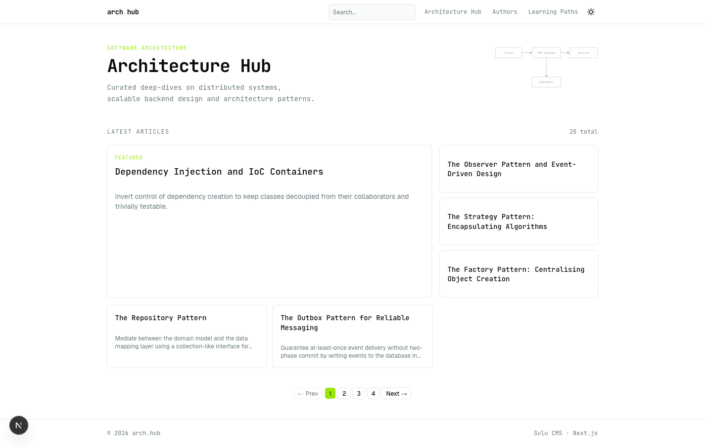
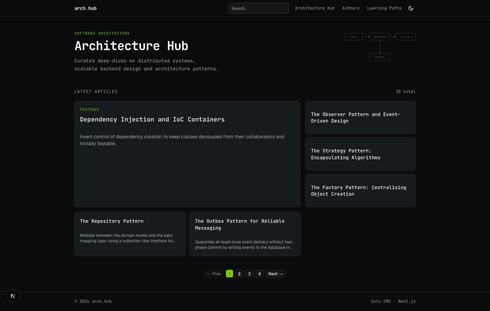

# Architecture Hub Showcase

A headless knowledge platform for software architecture and system design — built to explore Sulu CMS + Next.js as a JAMstack pairing, and where DDD (ports-and-adapters isolation) actually earns its keep on top of a CMS versus where it's just noise.

> **Live demo**: [arch-hub-tawny.vercel.app](https://arch-hub-tawny.vercel.app)

[](https://github.com/PatrykOstrzolek/architecture-hub-showcase/actions/workflows/ci-backend.yml)
[](https://github.com/PatrykOstrzolek/architecture-hub-showcase/actions/workflows/ci-frontend.yml)
[](https://github.com/PatrykOstrzolek/architecture-hub-showcase/actions/workflows/ci-security.yml)

<p align="center">
  
  
</p>

---

## What this project demonstrates

This is a portfolio project, not a commercial product. The core question it's working through: Sulu CMS as a headless JAMstack backend paired with Next.js, and — deliberately, not by default — where a DDD `Domain/Application/Infrastructure` split is worth the isolation cost on top of a CMS, versus where plain Sulu-native CRUD is simply correct.

- **Content modeling** in a headless CMS (Sulu): page templates, block types, taxonomy, navigation API
- **Frontend** with Next.js 15: React Server Components, ISR caching, Tailwind CSS, shadcn/ui, dark mode
- **Selective DDD** — most of the backend stays flat, Sulu-native CRUD; the one bounded context with real business logic (server-graded exercise attempts) gets the `Domain/Application/Infrastructure` split, introduced only once that logic existed
- **Spec-driven development**: every feature starts with a written spec and ends with an ADR if a non-trivial decision was made

It also includes a full CI/CD and infra setup — not the main point, but real and working:

- **CI pipeline**: PHPStan, PHP CS Fixer, PHPUnit, Trivy, Semgrep, npm audit — running in parallel on every push
- **CD pipeline**: Docker image build → GHCR → Ansible deploy to VPS; frontend to Vercel
- **Infrastructure as code**: Ansible roles for provisioning (Docker, nginx, UFW, fail2ban) and rolling deploys
- **Security hardening**: HTTP security headers, HTML sanitization, Symfony profiler disabled in prod, secrets out of git

---

## Stack

| Layer | Technology |
|---|---|
| **Frontend** | Next.js 15, React, TypeScript, Tailwind CSS, shadcn/ui |
| **CMS / Backend** | Sulu CMS, Symfony, PHP 8.5 |
| **Database** | PostgreSQL 16 |
| **Infrastructure** | Docker, Docker Compose, Ansible, nginx |
| **CI/CD** | GitHub Actions, GHCR, Vercel |
| **Security** | Trivy, Semgrep, sanitize-html, OWASP headers |

---

## Architecture highlights

- **Selective DDD, not a hexagonal rewrite** — the backend stays a flat, Sulu-native `Controller/Entity/Repository` structure everywhere content authoring is the concern. The one place with actual business logic — grading exercise attempts server-side — is split into an `Assessment` bounded context (`Domain/Application/Infrastructure`), introduced only once that logic existed, not speculatively. ([ADR-0012](docs/architecture/adrs/0012-assessment-bounded-context.md))
- **Headless CMS** — Sulu serves content via its built-in JSON API; Next.js consumes it as a pure presentation layer. No custom backend API for MVP. ([ADR-0003](docs/architecture/adrs/0003-headless-content-delivery.md))
- **ISR caching** — article and learning-path pages are statically generated and revalidated on a short TTL. ([ADR-0008](docs/architecture/adrs/0008-nextjs-caching-strategy.md))
- **Frontend on Vercel, backend on a self-hosted VPS** — decoupled deployment targets. Next.js is built and served by Vercel (CDN, TLS, previews); Sulu runs as Docker containers on a [Mikrus](https://mikr.us) VPS behind an nginx reverse proxy, provisioned with Ansible and deployed from images published to GitHub Container Registry. PostgreSQL runs as its own container on that same VPS — a deliberately low-cost setup rather than a managed database service — bound to `127.0.0.1`, never on the public internet. Each side scales and deploys independently. ([ADR-0009](docs/architecture/adrs/0009-vercel-frontend-deployment.md), [infrastructure](docs/operations/infrastructure.md))
- **Security-first** — full audit with Semgrep + Trivy wired into CI; findings documented with accepted risks. ([ADR-0010](docs/architecture/adrs/0010-security-hardening.md))

All architectural decisions are in [`docs/architecture/adrs/`](docs/architecture/adrs/README.md).

---

## Local development

### Prerequisites

```bash
which docker npm mise symfony
```

Docker just needs to be running (any local Docker runtime works) — it's only used for Postgres and Mailpit. PHP itself runs on the host via [mise](https://mise.jdx.dev) (version pinned in the repo's `mise.toml`), and the dev server runs via [Symfony CLI](https://symfony.com/download) (`brew install symfony-cli/tap/symfony-cli`, not mise-managed). See [ADR-0017](docs/architecture/adrs/0017-mise-managed-host-php-for-local-dev.md).

### Backend

PHP's memory limit is set to 1G via `backend/php-conf.d/local.ini`, loaded automatically through `mise.toml`'s `PHP_INI_SCAN_DIR` — no inline `-d memory_limit` flags needed.

```bash
cd backend
cp .env.example .env          # fill in DB credentials
docker compose up -d          # starts PostgreSQL and Mailpit
composer install
bin/console sulu:build dev --destroy   # drops, recreates, and builds the schema from scratch — no migrate step needed
symfony serve                 # dev server
```

### Frontend

```bash
cd frontend
npm install
cp .env.example .env.local    # set SULU_BASE_URL
npm run dev
```

Frontend runs at `http://localhost:3000`, Sulu admin at `http://localhost:8000/admin`.

See [`docs/development/fixtures.md`](docs/development/fixtures.md) for fixture loading and [`docs/development/workflow.md`](docs/development/workflow.md) for coding standards.

---

## Deployment

Fully automated — push to `main` triggers CI → CD.

See [`docs/operations/deployment.md`](docs/operations/deployment.md) for the pipeline breakdown and one-time server provisioning steps.

---

## Documentation

| Directory | Contents |
|---|---|
| [`docs/business/`](docs/business/vision.md) | Project vision and goals |
| [`docs/product/`](docs/product/product-spec.md) | Product spec, feature specs, MVP checklist |
| [`docs/architecture/`](docs/architecture/adrs/README.md) | ADRs and content type reference |
| [`docs/operations/`](docs/operations/infrastructure.md) | Infrastructure, deployment, security |
| [`docs/development/`](docs/development/workflow.md) | Development workflow and standards |
